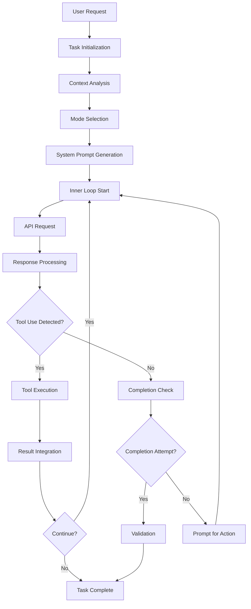

# Kilocode Agentic AI Framework Documentation

## Table of Contents
1. [Architecture Overview](#architecture-overview)
2. [Core Components](#core-components)
3. [Inner Loop Implementation](#inner-loop-implementation)
4. [Technical Implementation](#technical-implementation)
5. [Usage Examples](#usage-examples)
6. [API Reference](#api-reference)
7. [Advanced Features](#advanced-features)
8. [Best Practices](#best-practices)
9. [Troubleshooting](#troubleshooting)
10. [Contributing](#contributing)

## Architecture Overview

The Kilocode agentic AI framework enables AI agents to operate autonomously in an "inner loop" pattern, where they can complete user-provided tasks without constant human intervention. The framework is built on a sophisticated task execution engine that combines intelligent planning, tool orchestration, and adaptive decision-making.

### Key Architectural Principles

- **Autonomous Execution**: Agents operate independently within defined boundaries
- **Tool-Driven Architecture**: All capabilities are exposed through a unified tool system
- **Mode-Based Specialization**: Different operational modes optimize agent behavior for specific task types
- **Extensible Design**: MCP (Model Context Protocol) integration allows dynamic capability expansion
- **Robust Error Handling**: Self-correction mechanisms and graceful degradation

### High-Level Architecture

```
┌─────────────────────────────────────────────────────────────┐
│                    User Interface Layer                     │
│  ┌─────────────────┐  ┌─────────────────┐  ┌─────────────────┐ │
│  │   VS Code UI    │  │   Webview UI    │  │  Command Palette │ │
│  └─────────────────┘  └─────────────────┘  └─────────────────┘ │
└─────────────────────────────────────────────────────────────┘
                              │
┌─────────────────────────────────────────────────────────────┐
│                   Agent Orchestration Layer                 │
│  ┌─────────────────┐  ┌─────────────────┐  ┌─────────────────┐ │
│  │  Task Manager   │  │  Mode System    │  │  State Manager  │ │
│  └─────────────────┘  └─────────────────┘  └─────────────────┘ │
└─────────────────────────────────────────────────────────────┘
                              │
┌─────────────────────────────────────────────────────────────┐
│                    Execution Engine Layer                   │
│  ┌─────────────────┐  ┌─────────────────┐  ┌─────────────────┐ │
│  │  Tool System    │  │  API Handlers   │  │  Context Engine │ │
│  └─────────────────┘  └─────────────────┘  └─────────────────┘ │
└─────────────────────────────────────────────────────────────┘
                              │
┌─────────────────────────────────────────────────────────────┐
│                   Integration Layer                         │
│  ┌─────────────────┐  ┌─────────────────┐  ┌─────────────────┐ │
│  │  MCP Servers    │  │  File System    │  │  Terminal/Shell │ │
│  └─────────────────┘  └─────────────────┘  └─────────────────┘ │
└─────────────────────────────────────────────────────────────┘
```

## Core Components

### 1. Task Planning and Decomposition

The framework employs a sophisticated task planning system that breaks down complex user requests into actionable steps:

#### Task Class (`src/core/task/Task.ts`)
The central orchestrator that manages the entire task lifecycle:

- **Task Initialization**: Creates unique task instances with proper context
- **Conversation Management**: Maintains API conversation history and state
- **Execution Coordination**: Orchestrates the inner loop execution pattern
- **Error Recovery**: Handles failures and implements retry mechanisms

#### Key Planning Mechanisms:

1. **Natural Language Processing**: Parses user intent from natural language descriptions
2. **Context Analysis**: Analyzes workspace state and available resources
3. **Step Decomposition**: Breaks complex tasks into atomic operations
4. **Dependency Resolution**: Identifies and manages task dependencies

### 2. Decision-Making Processes

The agent's decision-making is guided by several interconnected systems:

#### Mode System (`src/shared/modes.ts`)
Specialized operational modes that optimize agent behavior:

- **Code Mode**: General-purpose coding and development tasks
- **Architect Mode**: Planning and design-focused operations
- **Debug Mode**: Systematic problem diagnosis and resolution
- **Ask Mode**: Information gathering and question answering
- **Orchestrator Mode**: Complex workflow coordination

#### Tool Selection Algorithm
The agent selects appropriate tools based on:
- Current mode capabilities and restrictions
- Task context and requirements
- Available tool groups and permissions
- Historical success patterns

### 3. Tool Integration and Execution

The framework provides a comprehensive tool system that enables agent capabilities:

#### Core Tool Categories (`packages/types/src/tool.ts`):

```typescript
export const toolGroups = ["read", "edit", "browser", "command", "mcp", "modes"] as const

export const toolNames = [
    "execute_command",     // Terminal command execution
    "read_file",          // File system reading
    "write_to_file",      // File creation and modification
    "apply_diff",         // Code change application
    "search_files",       // Content search across files
    "list_files",         // Directory exploration
    "browser_action",     // Web browser automation
    "use_mcp_tool",       // MCP server tool execution
    "attempt_completion", // Task completion validation
    "switch_mode",        // Mode transitions
    // ... additional tools
] as const
```

#### Tool Execution Framework
Each tool follows a standardized execution pattern:

1. **Parameter Validation**: Ensures required parameters are provided
2. **Permission Checking**: Validates tool usage against current mode
3. **Execution**: Performs the actual tool operation
4. **Result Processing**: Formats and returns execution results
5. **Error Handling**: Manages failures and provides feedback

### 4. Feedback Loops and Self-Correction

The framework implements multiple feedback mechanisms for autonomous operation:

#### Consecutive Mistake Detection
```typescript
if (this.consecutiveMistakeCount >= this.consecutiveMistakeLimit) {
    const { response, text, images } = await this.ask(
        "mistake_limit_reached",
        t("common:errors.mistake_limit_guidance"),
    )
    // Reset and provide guidance
    this.consecutiveMistakeCount = 0
}
```

#### Tool Repetition Detection
Prevents infinite loops by detecting repetitive tool usage patterns and suggesting alternative approaches.

#### Validation Mechanisms
- **Syntax Checking**: Validates code before execution
- **Test Execution**: Runs tests to verify functionality
- **Diff Analysis**: Reviews changes before application
- **User Confirmation**: Requests approval for significant operations

## Inner Loop Implementation

The core of the agentic framework is the inner loop execution pattern implemented in the `initiateTaskLoop` and `recursivelyMakeClineRequests` methods:

### 1. Task Receipt and Interpretation

```typescript
private async initiateTaskLoop(userContent: Anthropic.Messages.ContentBlockParam[]): Promise<void> {
    let nextUserContent = userContent
    let includeFileDetails = true
    
    this.emit("taskStarted")
    
    while (!this.abort) {
        const didEndLoop = await this.recursivelyMakeClineRequests(nextUserContent, includeFileDetails)
        includeFileDetails = false
        
        if (didEndLoop) {
            break
        } else {
            // Agent didn't use tools - prompt for completion or continuation
            nextUserContent = [{ type: "text", text: formatResponse.noToolsUsed() }]
            this.consecutiveMistakeCount++
        }
    }
}
```

### 2. Autonomous Step Execution

The recursive request pattern enables autonomous operation:

1. **Request Processing**: Analyzes user content and context
2. **Tool Selection**: Chooses appropriate tools based on task requirements
3. **Execution**: Performs tool operations autonomously
4. **Result Integration**: Incorporates results into conversation context
5. **Continuation Decision**: Determines whether to continue or complete

### 3. Progress Monitoring and Adaptation

The framework continuously monitors execution progress:

- **State Tracking**: Maintains comprehensive task state
- **Progress Indicators**: Provides real-time execution feedback
- **Adaptive Behavior**: Adjusts strategy based on intermediate results
- **Obstacle Handling**: Automatically recovers from common failures

### 4. Completion Validation

Task completion is validated through multiple mechanisms:

```typescript
// Agent signals completion
const didToolUse = this.assistantMessageContent.some((block) => block.type === "tool_use")

if (!didToolUse) {
    // Prompt agent to either use tools or attempt completion
    this.userMessageContent.push({ type: "text", text: formatResponse.noToolsUsed() })
    this.consecutiveMistakeCount++
}
```

The `attempt_completion` tool provides structured completion validation with user approval.

## Technical Implementation

### Agent Initialization and Configuration

```typescript
export class Task extends EventEmitter<ClineEvents> {
    constructor({
        context,
        provider,
        apiConfiguration,
        enableDiff = false,
        enableCheckpoints = true,
        fuzzyMatchThreshold = 1.0,
        consecutiveMistakeLimit = 3,
        task,
        images,
        historyItem,
        startTask = true,
        // ... additional options
    }: TaskOptions) {
        super()
        
        // Initialize core components
        this.diffStrategy = new MultiSearchReplaceDiffStrategy(this.fuzzyMatchThreshold)
        this.toolRepetitionDetector = new ToolRepetitionDetector(this.consecutiveMistakeLimit)
        this.fileContextTracker = new FileContextTracker(provider, this.taskId)
        
        // Start task execution if requested
        if (startTask) {
            if (task || images) {
                this.startTask(task, images)
            } else if (historyItem) {
                this.resumeTaskFromHistory()
            }
        }
    }
}
```

### Execution Flow Architecture

The execution flow follows a sophisticated pattern that enables autonomous operation:



### Integration Points

#### MCP Server Integration
```typescript
// MCP tool execution
const toolResult = await cline.providerRef
    .deref()
    ?.getMcpHub()
    ?.callTool(server_name, tool_name, parsedArguments)
```

#### File System Operations
```typescript
// File reading with context tracking
await this.fileContextTracker.recordFileRead(path, RecordSource.Tool)
const content = await extractTextFromFile(path)
```

#### Terminal Integration
```typescript
// Command execution with shell integration
const terminal = await TerminalRegistry.getOrCreateTerminal(workingDir, !!customCwd, cline.taskId, terminalProvider)
const process = terminal.runCommand(command, callbacks)
```

### Error Handling and Recovery

The framework implements comprehensive error handling:

```typescript
try {
    const [rejected, result] = await executeCommand(cline, options)
    if (rejected) {
        cline.didRejectTool = true
    }
    pushToolResult(result)
} catch (error: unknown) {
    if (error instanceof ShellIntegrationError) {
        // Fallback to alternative execution method
        const [rejected, result] = await executeCommand(cline, {
            ...options,
            terminalShellIntegrationDisabled: true,
        })
        pushToolResult(result)
    } else {
        pushToolResult(`Command failed to execute: ${error.message}`)
    }
}
```

## Usage Examples

### Example 1: Autonomous Code Generation

```typescript
// User request: "Create a REST API for user management"
const task = new Task({
    context,
    provider,
    apiConfiguration,
    task: "Create a REST API for user management with CRUD operations",
    startTask: true
})

// The agent autonomously:
// 1. Analyzes the request and switches to Code mode
// 2. Creates project structure using list_files and write_to_file
// 3. Implements endpoints with proper error handling
// 4. Adds tests using execute_command
// 5. Validates functionality and attempts completion
```

### Example 2: Debugging Workflow

```typescript
// User request: "Debug the failing test in user.test.js"
const task = new Task({
    context,
    provider,
    apiConfiguration,
    task: "Debug the failing test in user.test.js and fix the issue",
    startTask: true
})

// The agent autonomously:
// 1. Switches to Debug mode for systematic diagnosis
// 2. Reads the failing test file
// 3. Executes tests to see failure output
// 4. Analyzes code to identify potential issues
// 5. Implements fixes and validates resolution
```

### Example 3: Architecture Planning

```typescript
// User request: "Plan the architecture for a microservices system"
const task = new Task({
    context,
    provider,
    apiConfiguration,
    task: "Design architecture for a microservices-based e-commerce system",
    startTask: true
})

// The agent autonomously:
// 1. Switches to Architect mode for planning focus
// 2. Gathers requirements through ask_followup_question
// 3. Researches best practices using browser_action
// 4. Creates architectural diagrams and documentation
// 5. Provides detailed implementation plan
```

## API Reference

### Core Classes

#### Task
The main agent execution class.

**Constructor Options:**
- `context: vscode.ExtensionContext` - VS Code extension context
- `provider: ClineProvider` - Provider instance for communication
- `apiConfiguration: ProviderSettings` - AI model configuration
- `task?: string` - Initial task description
- `images?: string[]` - Associated images
- `enableDiff?: boolean` - Enable diff-based editing
- `enableCheckpoints?: boolean` - Enable state checkpointing

**Key Methods:**
- `startTask(task: string, images?: string[])` - Begin task execution
- `resumeTaskFromHistory()` - Resume from saved state
- `abort()` - Stop task execution
- `say(type: ClineSay, text?: string)` - Send message to conversation

#### ClineProvider
Manages agent instances and communication.

**Key Methods:**
- `createTask(options: TaskOptions)` - Create new task instance
- `getMcpHub()` - Access MCP server integration
- `handleModeSwitch(mode: string)` - Change operational mode

### Tool System

#### Tool Registration
```typescript
// Tool execution pattern
export async function toolName(
    cline: Task,
    block: ToolUse,
    askApproval: AskApproval,
    handleError: HandleError,
    pushToolResult: PushToolResult,
    removeClosingTag: RemoveClosingTag,
) {
    // Tool implementation
}
```

#### Available Tools
- **File Operations**: `read_file`, `write_to_file`, `apply_diff`, `search_files`, `list_files`
- **Code Analysis**: `list_code_definition_names`, `codebase_search`
- **Execution**: `execute_command`
- **Web Automation**: `browser_action`
- **MCP Integration**: `use_mcp_tool`, `access_mcp_resource`
- **Task Management**: `attempt_completion`, `switch_mode`, `new_task`

### Mode System

#### Built-in Modes
```typescript
export const modes: readonly ModeConfig[] = [
    {
        slug: "code",
        name: "Code",
        roleDefinition: "Skilled software engineer...",
        groups: ["read", "edit", "browser", "command", "mcp"],
    },
    // ... additional modes
]
```

#### Custom Mode Creation
```typescript
const customMode: ModeConfig = {
    slug: "custom-mode",
    name: "Custom Mode",
    roleDefinition: "Specialized role definition...",
    groups: ["read", "edit"], // Restricted tool access
    customInstructions: "Additional behavior guidelines...",
}
```

### MCP Integration

#### MCP Hub Architecture
The Model Context Protocol (MCP) integration allows dynamic extension of agent capabilities through external servers:

```typescript
export class McpHub {
    private connections: McpConnection[] = []

    async callTool(serverName: string, toolName: string, arguments: any) {
        const connection = this.connections.find(c => c.server.name === serverName)
        if (!connection) {
            throw new Error(`MCP server '${serverName}' not found`)
        }

        return await connection.client.callTool({ name: toolName, arguments })
    }
}
```

#### MCP Server Configuration
```json
{
    "mcpServers": {
        "filesystem": {
            "type": "stdio",
            "command": "npx",
            "args": ["-y", "@modelcontextprotocol/server-filesystem", "/path/to/workspace"]
        },
        "git": {
            "type": "stdio",
            "command": "npx",
            "args": ["-y", "@modelcontextprotocol/server-git", "--repository", "/path/to/repo"]
        }
    }
}
```

## Advanced Features

### Context Management and Sliding Window

The framework implements sophisticated context management to handle long conversations:

```typescript
// Automatic context condensation
const { messages, summary, cost } = await summarizeConversation(
    this.apiConversationHistory,
    this.api,
    systemPrompt,
    this.taskId,
    prevContextTokens,
    false, // manual trigger
    customCondensingPrompt,
    condensingApiHandler,
)
```

### Checkpoint System

State checkpointing enables recovery and rollback capabilities:

```typescript
// Automatic checkpoint creation
export async function checkpointSave(cline: Task, force = false) {
    const service = getCheckpointService(cline)
    if (!service?.isInitialized) return

    return service.saveCheckpoint(`Task: ${cline.taskId}, Time: ${Date.now()}`, { allowEmpty: force })
}

// Checkpoint restoration
export async function checkpointRestore(cline: Task, { ts, commitHash, mode }: CheckpointRestoreOptions) {
    const service = await getInitializedCheckpointService(cline)
    if (!service) return

    await service.restoreCheckpoint(commitHash)
}
```

### File Context Tracking

Intelligent file context management optimizes performance and relevance:

```typescript
export class FileContextTracker {
    async recordFileRead(path: string, source: RecordSource) {
        // Track file access patterns
        this.accessHistory.set(path, {
            lastAccessed: Date.now(),
            accessCount: (this.accessHistory.get(path)?.accessCount || 0) + 1,
            source
        })
    }

    getRelevantFiles(limit: number = 10): string[] {
        // Return most relevant files based on access patterns
        return Array.from(this.accessHistory.entries())
            .sort((a, b) => b[1].lastAccessed - a[1].lastAccessed)
            .slice(0, limit)
            .map(([path]) => path)
    }
}
```

## Best Practices

### 1. Task Design
- **Clear Objectives**: Provide specific, actionable task descriptions
- **Context Provision**: Include relevant background information
- **Scope Definition**: Clearly define task boundaries and constraints

### 2. Mode Selection
- **Code Mode**: For implementation and development tasks
- **Architect Mode**: For planning and design phases
- **Debug Mode**: For systematic problem resolution
- **Ask Mode**: For information gathering and analysis

### 3. Tool Usage Optimization
- **Permission Management**: Configure appropriate tool groups for each mode
- **Resource Limits**: Set reasonable limits for file operations and command execution
- **Safety Measures**: Enable approval requirements for destructive operations

### 4. Error Handling
- **Graceful Degradation**: Design tasks to handle partial failures
- **Recovery Strategies**: Implement fallback approaches for common issues
- **User Feedback**: Provide clear error messages and suggested actions

## Troubleshooting

### Common Issues

#### 1. Task Execution Stalls
**Symptoms**: Agent stops responding or gets stuck in loops
**Solutions**:
- Check consecutive mistake limit settings
- Review tool permissions for current mode
- Verify API configuration and rate limits
- Enable debug logging for detailed execution traces

#### 2. Tool Execution Failures
**Symptoms**: Tools fail to execute or return errors
**Solutions**:
- Verify file permissions and workspace access
- Check terminal integration settings
- Validate MCP server configurations
- Review tool parameter validation

#### 3. Context Window Exhaustion
**Symptoms**: API errors related to token limits
**Solutions**:
- Enable automatic context condensation
- Configure appropriate condensation thresholds
- Use checkpoint system for long-running tasks
- Optimize file reading strategies

### Debugging Techniques

#### 1. Enable Verbose Logging
```typescript
// Enable detailed execution logging
const task = new Task({
    // ... other options
    enableDebugLogging: true
})
```

#### 2. Monitor Tool Usage
```typescript
// Track tool execution patterns
task.on('toolExecuted', (toolName, result, error) => {
    console.log(`Tool ${toolName}: ${error ? 'FAILED' : 'SUCCESS'}`)
    if (error) console.error(error)
})
```

#### 3. Analyze Conversation History
```typescript
// Review conversation flow
const messages = task.clineMessages
const apiHistory = task.apiConversationHistory
```

## Contributing

### Adding New Tools

1. **Define Tool Schema**:
```typescript
// Add to packages/types/src/tool.ts
export const toolNames = [
    // ... existing tools
    "new_tool_name",
] as const
```

2. **Implement Tool Function**:
```typescript
// Create src/core/tools/newToolTool.ts
export async function newToolTool(
    cline: Task,
    block: ToolUse,
    askApproval: AskApproval,
    handleError: HandleError,
    pushToolResult: PushToolResult,
    removeClosingTag: RemoveClosingTag,
) {
    // Tool implementation
}
```

3. **Add Tool Description**:
```typescript
// Add to src/core/prompts/tools/index.ts
const toolDescriptionMap: Record<string, (args: ToolArgs) => string | undefined> = {
    // ... existing tools
    new_tool_name: (args) => getNewToolDescription(args),
}
```

### Creating Custom Modes

1. **Define Mode Configuration**:
```typescript
const customMode: ModeConfig = {
    slug: "custom-mode",
    name: "Custom Mode",
    roleDefinition: "Detailed role description...",
    groups: ["read", "edit"], // Tool group permissions
    customInstructions: "Specific behavior guidelines...",
    whenToUse: "When to use this mode...",
}
```

2. **Register Mode**:
```typescript
// Add to custom modes configuration
await customModesManager.addMode(customMode)
```

### Extending MCP Integration

1. **Create MCP Server**:
```typescript
// Implement MCP server following the protocol specification
class CustomMcpServer {
    async listTools() {
        return [
            {
                name: "custom_tool",
                description: "Custom tool description",
                inputSchema: { /* JSON schema */ }
            }
        ]
    }

    async callTool(request: CallToolRequest) {
        // Tool implementation
        return { content: [{ type: "text", text: "Result" }] }
    }
}
```

2. **Configure Server**:
```json
{
    "mcpServers": {
        "custom-server": {
            "type": "stdio",
            "command": "node",
            "args": ["path/to/custom-server.js"]
        }
    }
}
```

---

This comprehensive documentation provides developers with the knowledge needed to understand, use, and contribute to the Kilocode agentic framework. The framework's sophisticated architecture enables powerful autonomous AI agents while maintaining safety, extensibility, and user control through its mode system, tool restrictions, and approval mechanisms.

The inner loop pattern at the heart of the framework allows agents to operate with remarkable autonomy while providing multiple safety nets and feedback mechanisms to ensure reliable, predictable behavior. Whether you're building simple automation scripts or complex multi-step workflows, the Kilocode framework provides the foundation for creating intelligent, autonomous AI agents that can work effectively in real-world development environments.
